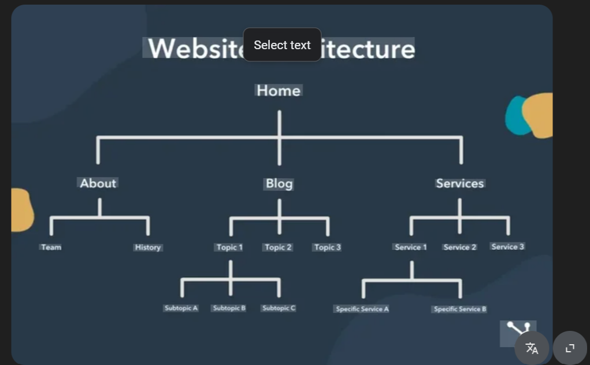

- *HTML + JS* frontend (Tier 1) - fetches data
- *FastAPI* - backend  (Tier 2) API layer 
- *Postgres DB* - storage   (Tier 3) proides 

# Tools & Technologies
- *AWS* Amazon Web Services
- *JENKINS* Jenkins Server
- *TERRAFORM* Terraform
- *GIT* GitHub
- *Data Storage* *Postgres*
- *Containerization* - *Docker*

#  architectural design
